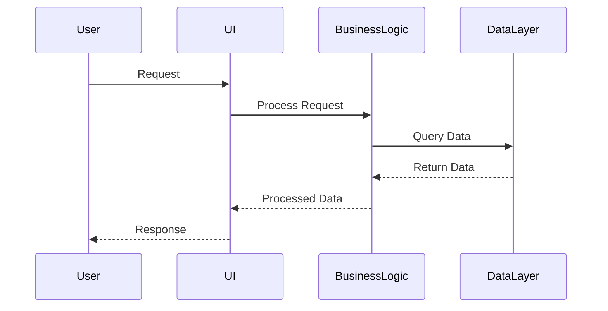
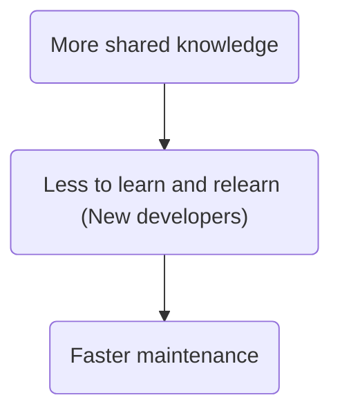

Problem with course software examples can break in real world 

---

## Aim for simulating real world scenarios 

### Real scenarios 

1. Variables skill sets 
2. Different levels of understanding 
3. Different mental models 

Come up with process easing things 

SDLC - Software Dev life cycle 

- Ideas 
- Code
- Use
- Fix

---

## Multiple Layers 

Code reuse  - Across applications and application tiers 
testing 
Decoupling
Finding errors 
Long term maintenance - understand areas of code - where are the dependencies 

Well defined 

- Datalayer 
    - Database access and error handling 
- Business layer logic 
    - Can this be done or that cant be done etc 
- API/web 
    - Endpoint interaction 
- UI 
    - Display stuffs 

Using any framework in any not well defined layered application can cause a lot of pain and waste a lot of time

---

## Multiple application and tiers 

Shared code base 

shared business logic 

---

## Common knowledge and maintenance 

- Companies architecture 
- Value in common patterns 
- Abstractions in software patterns 
    - Service locator pattern 
- Layer allows for hiding for time being and focus 

---

## Choosing an architecture 

Overkill is also bad 
under doing is also bad 

find the rite balance 

`Everything is a nail syndrome`

Good architecture is more of a theory 

A POC is always a good choice for validating 

Refactor early 
- Refactor early is key to less code affected 
- Benefit from the improvement is sooner 
- Change requires the least amount of time

Never be satisfied (mentally be satisfied)
- Be willing to change 
- Know there is no perfect software 
---

